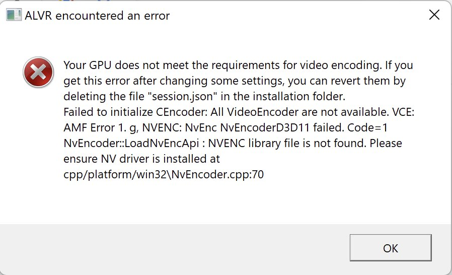

Ah, the **RX 6500 XT**. No doubts that this graphics card will be remembered years on as an ugly artifact of the great chip shortage. It only exists because things are really desperate, and its launch did not go well: performing on par or worse than 2016 cards for the same price point, being restricted to 4 PCI lanes *(which is especially problematic on PCI 3.0 systems, being my case)*, and lacking dedicated video encoding capabilities would simply be unacceptable if the graphics card market wasn't starving for supply.

But, credit where credits' due, AMD did deliver on their promise: the card has plenty of stock, and it is near MSRP. Shun AMD all you want, Nvidia's **RTX 3050** launch was a mess: it ran out in just 10 minutes and then reappeared at 60% over MSRP a few weeks later. Meanwhile, the **RX 6500 XT** was consistently on stock at its MSRP value for a whole week after launch, and at the time of writing, it's still easily available for cheaper than I actually paid for it on launch day.

So yeah, the card is nothing extraordinary, but I learned to accept I simply could not get anything better at that point. And, despite all those issues, it is a pretty good graphics card for my needs.

That is until I tried VR. And the lack of that hardware video encoding came to bite me hard.

# Oculus fails

I got the Oculus Quest 2 a few months earlier. It's a really good device, and for only 350€ ~~*(and selling your soul to Facebook)*~~ it's a bargain to getting into VR. As enjoyable as the Quest apps are, I did purchase it to eventually run PC VR content as well: especially **Half Life Alyx**, the game I *eagerly* waited 2 years to finally enjoy.

So, with a new *shiny* graphics card that supposedly meets the game's minimum requirements, I excitedly hooked up the headset to try PC VR for the first time.

*Aaaand*, a whole lot of nothing: just a black screen, with the computer not hinting any graphically intensive app running. Which is odd: I had tried it months earlier with the integrated **GPU**, and it worked; *at 5 or so FPS*, sure, but **it worked**.

Since it's a new graphics card, I assumed it was some sort of issue that would be patched by either Oculus or AMD, so the next week I tried again. Still nothing.

At this point, and after finding more people online complaining the same, I decided to contact Oculus Support, which to their credit was very friendly, and helpful in debugging issues. But that hope was shut down when, after a few weeks of following Oculus troubleshooting, they told me AMD has communicated to them that this graphics card is simply not supported for VR, and therefore they cannot offer any more help.

Dang it. There goes my hope of playing HL:Alyx, and considering I bought so much hardware that feasibly could run it, I was pretty upset about it. But no dice, Oculus and AMD were not gonna help me.

Which means, it's time to look for alternatives.

# Alternative software

Oculus Link / Air Link is the officially supported method of playing PC VR through the Quest. But it's not the only method: there are other popular ways.

The most well-known is [Virtual Desktop](https://www.vrdesktop.net/) which, besides letting you use your desktop in VR, lets you stream SteamVR content to the headset wirelessly. However, it's a paid program, and 20€ is too much for me to spend when I don't even know if my system can actually run VR content.

The other known alternative is [ALVR](https://alvr-org.github.io/) *(Air Light VR)*, which essentially does the same thing, but focuses more on presenting SteamVR content. This one appealed more to me because, apart from being free, it was open-source.

So, I decided to try it. I downloaded it, set it up on my system, sideloaded their client app on the Quest, *aaaand*...

F\*\*\*. At this point, I was seriously regretting having picked this graphics card. **ALVR**, my last choice, also requires hardware-accelerated devices, leaving me dead in the water.

However, the Linux version has a software encoder. I tried it there, and it actually works! But there was one major issue: the performance was **terrible**. Not only was my PC struggling to run at 72FPS at SteamVR Home, but the video itself was weird, jittery, and with weird epilepsy-inducing artifacts. Tabletop Simulator, a very graphically-simple VR app, dropped it to 30FPS which, for VR, means you either move very slowly or experience massive amounts of delay and instant motion sickness.

This was a huge letdown; it seemed the graphics card wasn't powerful enough for VR. I was about to give up when someone at **ALVR**'s Discord tipped off that the **CPU** probably has a video encoder, which I actually had no idea of.

An idea formed then: what if there was a way to have the dedicated **GPU** run the VR content, and pass it on to the integrated **GPU**, letting it handle video encoding? On Linux, the software encoding latency was pretty big, so if the CPU's encoder could be used, it might work well enough. And, because this project is open-source, I could actually try doing that.

Having no better thing to do, a week of free time, and honestly a powerful driving desire to play HL:Alyx, my development journey began.

# Dual-GPU attempt

While I'm experienced in developing on Linux and have some practice on OpenGL, I basically never coded on Windows API, and literally never used DirectX. Coupled with the fact I'm diving into a new codebase, the initial development moments were pretty overwhelming. It also doesn't help the fact I tend not to ask for help from the developers. I always assume I'm not supposed to waste their time with me, so I always try to go solo first.

Luckily for me, the project was coded in a way that lets two different **DirectX** adapters *(aka graphics devices)* to be used for rendering and encoding. It was definitely not designed for what I intended to do, but it did let me easily experiment with that. So, the first challenge was solved: I got the dedicated **GPU** rendering VR content, and now the encoder was running on the **iGPU**, waiting for content. The VR performance on Windows was also more than double what I got on Linux, leaving me more hopeful than ever that this graphics card has what it takes for VR. I went ahead and launched the app on Quest, but unfortunately, the video feed stayed frozen as if no data was being transmitted.

Using [Wireshark](https://www.wireshark.org/) I could see the PC and Quest were communicating data, but it looked suspiciously empty, filled with a bunch of `0x00`s. Not sure what was going wrong, I decided to find a way to inspect the texture being transmitted. Initially, I tried to use [Renderdoc](https://renderdoc.org/), a really useful graphics debugger, but SteamVR did not like it, crashing every time I tried to inject into it. As Renderdoc has a strong position regarding the use of this tool on non-authorized software, I did not bother with getting it to work. So, I decided to dump the texture as a file instead.

To do that, I found the [Map()](https://docs.microsoft.com/en-us/windows/win32/api/d3d11/nf-d3d11-id3d11devicecontext-map) function. This essentially lets the **CPU** access a texture on **GPU** memory. SteamVR doesn't want me messing with its texture settings though, so I had to duplicate them before. Finally, I dumped the data in [PPM](https://en.wikipedia.org/wiki/Netpbm) format, as I didn't feel like figuring out some way or lib to export as **PNG**. So, after all that, I finally got a texture dumped to disk:

Huh, a whole lot of nothing. Great. That's *probably* the issue.

I decided to test it on another system though: a low-end laptop from my sister. It has no dedicated graphics card, so it runs on the integrated **GPU**. It was just a hunch really, I guess I wanted to be sure it was working on another setup, because in mine it was simply all black, and I did not have a clue as to why. So, I ported the code over, *aaaand*...

Ah-ha! It is actually working! Yeah sure, it looks corrupted *(it's supposed to look like the SteamVR loading screen)*, but it's probably only me badly interpreting the data when dumping it. I wasn't worried about that really: all I need is to check whether the texture has content or not, and in this setup it clearly does.

So, if it works on this single **iGPU** laptop, does this mean that the texture cannot be shared with another **GPU** like I'm doing? That's when I started searching for that fact, and while it was hard to find any sort of information about my scenario specifically, the little I found always mentioned it wasn't indeed possible for **GPU**'s to just share resources like this.

There is probably a way though: I came across [Shared Heaps](https://docs.microsoft.com/en-us/windows/win32/direct3d12/shared-heaps), which seems to be exactly what I need. However, it's a DirectX 12 feature only.

I even considered and explored how much effort it would take to port from DirectX 11 to 12, but that wasn't going to happen. DirectX 12 is basically "Vulkan", in the sense that a lot of things changed in the API, and many automatic things now have to be specified manually. I wasn't gonna rewrite the whole code to DirectX 12; that is a monumental task, would reduce compatibility with older devices unnecessarily, and the dev team would likely not see the point in doing that. All of that and I still don't know whether this approach would even work at all.

# Back to the drawing board

Alright, all that work for nothing. *Well, I did learn some DirectX actually*, but that's not the point: I want to play some HL:Alyx, dangit.

After thinking through and calmly, I decided there was only one thing that could really work: reimplement the software encoder from Linux to Windows. After the experience I had when trying on Linux, I wasn't confident the latency from software encoding would make it an enjoyable experience. But having learned a little of how DirectX works and looked through the codebase, I felt more confident in implementing that.

So, new alternative: let's reimplement the software encoding on Windows. I've been successful with retrieving texture data to the **CPU**, so I know there's a way to get that data. The challenge now is figuring out how the encoder works.

The library used on Linux is [FFmpeg](https://www.ffmpeg.org/), the main framework for all things video & audio. Luckily, it's also readily available on Windows, so I pressed on.

It was also at this point that I decided to ask questions on the project's Discord. And the devs are super friendly. One of the developers even went out of their way to help me with any issue I might have once they learned I was implementing software encoding on Windows. It really helped me emotionally knowing that what I was doing, or what I was having all this effort for, wasn't something dumb that wouldn't be accepted into the project; it's something desirable, useful for more people. Feeling more confident in pulling this through, I started porting the code from Linux to Windows.

The Linux backend uses Vulkan, which is actually integrated into the encoder. I couldn't find anything similar for DirectX at that time, so most of the challenge was just figuring out how to connect both systems successfully. Later on, I discovered there is [some wrapper code](https://ffmpeg.org/doxygen/3.1/structAVD3D11VAContext.html) for DirectX devices, which would probably make my life much easier. Oops, oh well, it might be useful someday later.

It was actually *too* easy, really. I was expecting this to be a multi-day effort, but all I needed was a chill afternoon porting code. Late in the night, I started experimenting as most of the code was ready. I had to fix some issues with SteamVR crashing, and the video feed on the Quest being a static green color.

But eventually, it worked. And even better, it worked smoothly. Compared to Linux this was a very feasible VR experience. The encode latency was not as big as I had anticipated, being around 10~15ms only.

So, it looks like the **RX 6500 XT** can do wireless VR after all. I was so happy that all this effort has actually paid off. But more so in knowing that other people in my situation, could finally enjoy wireless VR as well.

# Conclusion

I was really worried I had spent almost a whole week with research and experimentation without anything working, but eventually, I got VR to work on this graphics card. These are really strange times indeed, for a brand new **GPU** to not ship with hardware encoding capabilities. However, I felt motivated to figure out a solution after finding more and more people in my situation, eager to try VR through the Oculus Quest *(2)* with this **GPU**. Not to mention that my *really* strong desire to finally experience HL:Alyx is likely the only reason I pursued this goal to the end.

The feature was merged to **ALVR**, meaning it's officially bundled and ready for you to try. All you need to do is grab the latest [nightly build](https://github.com/alvr-org/ALVR-nightly/releases) *(until it gets a new official release)*, and go enjoy some VR content!