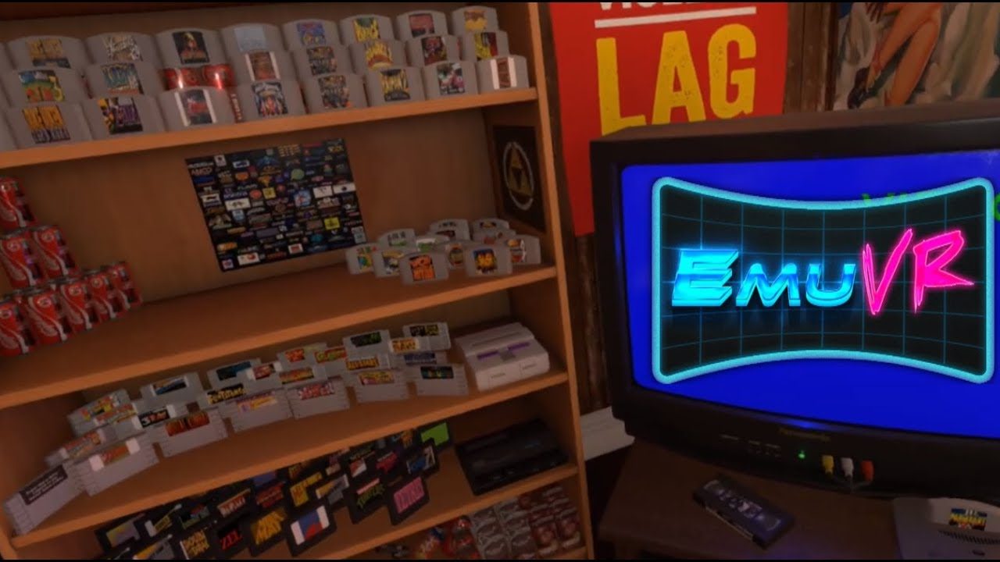

A long time ago, I did a setup with [EmulationStation](), a graphical emulator-frontend and [Retroarch], a frontend for the [libretro] ecosystem *(which centralizes a lot of emulators)*, to create a very robust library of retro games from many different systems. It was quite fun to set it all up and have a central system from where I can play anything I want in a plug-and-play fashion, without having to have dozens of different emulators, each with their own configs and quirks.

Last week I decided to modernize my setup as it was getting terribly outdated. Retroarch got so many better quality-of-life changes that I absolutely needed, as it used to be a tool where I had to be careful with the keyboard as it was a trap full of hotkeys and shortcuts which could screw up, not to mention everytime I mistook F1 for Esc it instantly quit the game without saving. EmulationStation didn't change significantly, so I decided to switch it up to the [Desktop Edition](https://es-de.org/), and overall I'm much more happy with it. It is still a bit finnicky and unintuitive, and since I was already modifying my setup, I looked for alternatives.

One major alternative I've found is [Pegasus](https://pegasus-frontend.org/), but after trying it it didn't impress me much further. Another launcher I tested was [Lutris](https://lutris.net/), but not only is this much more oriented to PC platforms such as Steam and GOG, it's interface was much less "gamer" focused, looking a lot like a desktop interface rather than a whole "gaming system".

In the meantime, companies finally did capitalize on nostalgia, with Nintendo releasing the NES and SNES Classic Mini Editions, and Sony with their PlayStation Classic *(we don't talk about the PS classic though)*. And looking at Nintendo's user interface, you really can't beat it's charm with just a custom theme on EmulationStation:

*(Source: [gameranx](https://gameranx.com/features/id/122346/article/snes-classic-edition-hidden-resets-shortcuts-secret-features-guide/))*

Another thing that caught my eye was the [EmuVR](https://www.emuvr.net/) project, which creates an emulator environment in VR. This goes way beyond than a simple interface: here, your games are carts laying around in a doormroom, and to play then you have to grab them, insert them into the console, and turn it on. It's such a whole level of interactivity that to my knowledge no other project has attempted yet:

*(Source: [Press start to begin - youtube](https://www.youtube.com/watch?v=075FKPRMfTc))*

Which is what drove me to consider a new project: RetroHub, where theme creation is simplified, and designers can run wild with ideas to provide new frontends for emulators.

## Main gripes with existing tools

This project is meant to create an easier environment for people to design themes. My main issue with both EmulationStation and Pegasus is that you essentially have to code the theme through config files. There isn't a [WYSIWYG](https://en.wikipedia.org/wiki/WYSIWYG) editor, which is crucial for this kind of work. Another issue is that they're highly constrained in terms of creativity: both only offer 2D interfaces, where only Pegasus does offer more flexibility as you can code custom behavior through JavaScript.

With this, and to allow any and all ideas on this regard, I decided to use Godot as the "backbone" of the project. For a multitude of reasons:

- Cross-platform from the start. Windows, macOS and Linux. Android and iOS eventually. Even consoles!
- Simpler programming language. Godot uses GDScript which is very similar to Python, a much friendlier language than C/C++ which is used on other projects
- Has an editor already. Providing a WYSIWYG theme editor is extremely simple.
- Yes I'm biased, ~~shut up~~